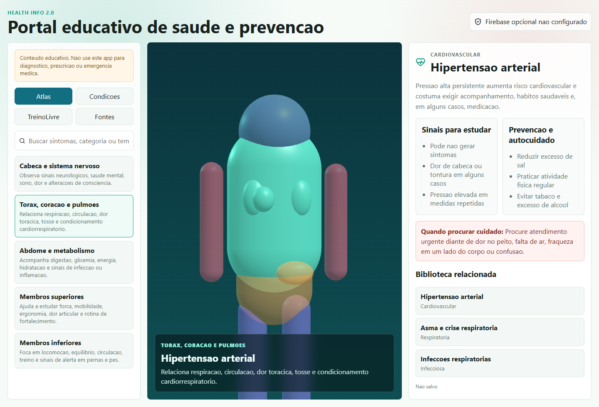

# Health Info

Portal educativo de saude para estudo, prevencao e organizacao de informacoes por sistemas do corpo. Esta versao substitui o antigo prototipo Android por uma aplicacao web em React + TypeScript + Three.js.

## O que tem agora



- Atlas 3D interativo do corpo humano para selecionar regioes de estudo.
- Biblioteca inicial de condicoes por categoria: cardiovascular, metabolica, respiratoria, saude mental, infecciosa e prevencao.
- Modulo TreinoLivre integrado com planos curtos de atividade preventiva.
- Login opcional com Google e salvamento simples de sessoes no Firestore.
- Sem Storage e sem upload de historico sensivel.

## Rodar localmente

```powershell
npm install
npm run dev
```

Build de producao:

```powershell
npm run build
npm run preview
```

## Firebase opcional

1. Copie `.env.example` para `.env`.
2. Preencha as variaveis `VITE_FIREBASE_*` com o SDK Web do Firebase.
3. Ative Google em Authentication.
4. Crie o Cloud Firestore em Native mode.
5. Publique as regras:

```powershell
npm install -g firebase-tools
firebase login
firebase deploy --only firestore:rules --project <seu-project-id>
```

As regras permitem apenas `users/{uid}/studySessions/{sessionId}` para o proprio usuario autenticado.

## Fontes de conteudo

- [WHO - Noncommunicable diseases](https://www.who.int/news-room/fact-sheets/detail/noncommunicable-diseases)
- [PAHO/WHO - Noncommunicable diseases](https://www.paho.org/en/topics/noncommunicable-diseases)
- [CDC - Physical Activity Guidelines](https://www.cdc.gov/physical-activity-basics/guidelines/index.html)

Este app e educativo. Ele nao substitui consulta, diagnostico, tratamento, emergencia medica ou orientacao de profissionais de saude.
